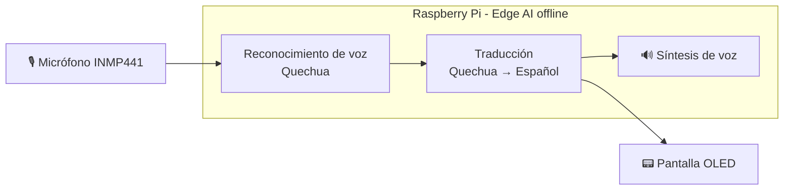
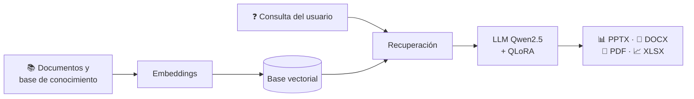

<!-- ========================================================= -->
<!--                 JHON ARONI SALAZAR                        -->
<!--              GitHub Profile README                        -->
<!-- ========================================================= -->

# 👋 Jhon Aroni Salazar

### `Ingeniero de Sistemas` · `AI Engineer` · `Backend Developer`

 

  

📍 Huancayo, Junín, Perú &nbsp;·&nbsp; 🎓 Universidad Nacional del Centro del Perú (UNCP) &nbsp;·&nbsp; 🗣️ Español (nativo) · Inglés (en progreso)

 

---

## 📑 Contenido

- [Sobre mí](#-sobre-mí)
- [Perfil profesional](#-perfil-profesional)
- [Formación académica](#-formación-académica)
- [Tech Stack](#-tech-stack)
- [Competencias técnicas](#-competencias-técnicas)
- [AI Engineering](#-ai-engineering)
- [Proyectos destacados](#-proyectos-destacados)
- [Computer Vision & Research](#️-computer-vision--research)
- [Investigación y publicaciones](#-investigación-y-publicaciones)
- [Certificaciones y cursos](#-certificaciones-y-cursos)
- [Hoja de ruta 2026](#️-hoja-de-ruta-2026)
- [GitHub Analytics](#-github-analytics)
- [Objetivos profesionales](#-objetivos-profesionales)
- [Colaboración](#-colaboración)
- [Contacto](#-conecta-conmigo)

---

## 🧠 Sobre mí

Soy estudiante de **Ingeniería de Sistemas en la Universidad Nacional del Centro del Perú (UNCP)**, actualmente cursando el **8.º semestre**.

Me interesa especialmente el desarrollo de **sistemas inteligentes**, **Inteligencia Artificial**, **IA Offline**, **Edge AI**, backend y automatización de procesos.

Mi objetivo profesional es desarrollarme como **AI Engineer**, combinando ingeniería de software, inteligencia artificial y soluciones tecnológicas aplicadas a problemas reales.

### 🚀 Actualmente enfocado en

* 🤖 Inteligencia Artificial aplicada
* 🧠 LLMs y sistemas RAG
* ⚡ IA Offline / Edge AI
* 🐍 Python para AI Engineering
* 🖥️ Backend y APIs
* 📱 Aplicaciones móviles
* 🌐 Desarrollo web
* 👁️ Computer Vision
* 🗄️ Bases de datos
* ☁️ Cloud & DevOps
* 🔐 Seguridad de la información

---

## 💼 Perfil profesional

<table>
<tr>
<td width="33%" valign="top">

**🎯 Rol objetivo**

AI Engineer / Backend Developer

</td>
<td width="33%" valign="top">

**🧭 Especialidad**

IA aplicada, Edge AI, Computer Vision y sistemas inteligentes

</td>
<td width="33%" valign="top">

**🌐 Enfoque**

Soluciones de impacto real con tecnología accesible, incluyendo contextos locales y de baja conectividad

</td>
</tr>
</table>

**Valor que aporto:** integro modelos de IA con backend, aplicaciones móviles/web y hardware físico, llevando ideas desde la investigación hasta un prototipo funcional.

---

## 🎓 Formación académica

| Institución | Programa | Estado |
|---|---|---|
| Universidad Nacional del Centro del Perú (UNCP) — Facultad de Ingeniería de Sistemas | Ingeniería de Sistemas | 8.º semestre (en curso) |

<!-- Opcional: agrega aquí certificaciones o cursos, por ejemplo:
| Plataforma | Curso / Certificación | Año | -->

---

## ⚡ Tech Stack

### 👨‍💻 Lenguajes

### 🧩 Frameworks & Desarrollo

### 🤖 AI & Data

### 🛠️ Herramientas

---

## 🧰 Competencias técnicas

| Área | Competencias |
|---|---|
| 🤖 **Inteligencia Artificial** | LLMs, RAG, fine-tuning con QLoRA, embeddings, Deep Learning |
| 👁️ **Computer Vision** | Detección y conteo de objetos con YOLO y OpenCV |
| ⚡ **Edge AI / IoT** | Raspberry Pi, procesamiento local, reconocimiento y síntesis de voz |
| 🖥️ **Backend** | Python, PHP (Laravel), Node.js (Express), diseño de APIs REST |
| 📱 **Móvil y Web** | Flutter, React Native (Expo), React, TypeScript, HTML/CSS |
| 🗄️ **Bases de datos** | MySQL, PostgreSQL |
| 🛠️ **Herramientas** | Git, GitHub, Docker, Linux, Postman, Figma, VS Code |
| 🔐 **Seguridad** | Fundamentos de seguridad de la información |

---

# 🤖 AI Engineering

 

<table>
<tr>
<td width="50%" align="center">

### 🧠 LLM & RAG

Desarrollo de sistemas capaces de consultar y generar información utilizando modelos de lenguaje y bases de conocimiento.

**Tecnologías**

`Python` `LLM` `RAG` `QLoRA` `Embeddings`

</td>

<td width="50%" align="center">

### ⚡ Offline AI

Desarrollo de soluciones inteligentes que buscan reducir la dependencia de servicios externos y conectividad permanente.

**Tecnologías**

`Raspberry Pi` `Edge AI` `Speech AI` `Local Models`

</td>
</tr>

<tr>
<td width="50%" align="center">

### 👁️ Computer Vision

Aplicación de visión artificial para detección, conteo y análisis de objetos.

**Tecnologías**

`Python` `YOLO` `OpenCV` `Deep Learning`

</td>

<td width="50%" align="center">

### 🧩 Intelligent Systems

Integración de IA con aplicaciones web, móviles y dispositivos físicos.

**Tecnologías**

`APIs` `Python` `Backend` `IoT` `Edge Computing`

</td>
</tr>
</table>

---

# 🚀 Proyectos Destacados

| Proyecto | Área | Stack principal |
|---|---|---|
| [QHICHWA-BAND](#️-qhichwa-band) | IA Offline · NLP Quechua | Python, Raspberry Pi, Speech AI |
| [RAG Educativo](#-rag-educativo) | LLM · RAG | Python, Qwen2.5, QLoRA |
| [WAWA-AI](#-wawa-ai) | Móvil | React Native, Expo, TypeScript |

## 🗣️ QHICHWA-BAND

### 💡 Descripción

**QHICHWA-BAND** es un proyecto de IA orientado a facilitar la comunicación entre **Quechua y Español** mediante un dispositivo wearable.

El sistema busca procesar voz en Quechua y generar una traducción al español directamente en el dispositivo, reduciendo la dependencia de Internet y teléfonos inteligentes.

### 🔥 Características

* 🎙️ Reconocimiento de voz
* 🧠 Procesamiento de IA en el dispositivo
* 🗣️ Conversión Quechua → Español
* 🔊 Síntesis de voz
* 📡 Funcionamiento offline
* ⚡ Procesamiento en Edge AI
* ⌚ Diseño orientado a wearable

### 🛠️ Tecnologías

`Python` `Raspberry Pi` `Speech AI` `LLM` `Edge AI` `OLED` `INMP441`

### 🧩 Flujo del sistema

<!-- Repositorio: [Ver código](https://github.com/Jhon-ArSa/NOMBRE-DEL-REPO) -->

---

## 📚 RAG Educativo

### 💡 Descripción

Sistema experimental de **Generación Aumentada por Recuperación (RAG)** orientado al ámbito educativo.

El proyecto utiliza modelos de lenguaje y bases de conocimiento para generar material académico a partir de información estructurada.

### 📄 Generación de contenido

* 📊 PowerPoint
* 📝 Word
* 📕 PDF
* 📈 Excel
* 📚 Material educativo
* 🧠 Contenido basado en conocimiento recuperado

### 🧠 Tecnologías

`Python` `Qwen2.5` `QLoRA` `RAG` `LLM` `Embeddings`

### 🧩 Arquitectura

<!-- Repositorio: [Ver código](https://github.com/Jhon-ArSa/NOMBRE-DEL-REPO) -->

---

## 📱 WAWA-AI

### 💡 Descripción

Aplicación móvil desarrollada con **React Native + Expo**, orientada a construir soluciones móviles modernas integrando funcionalidades inteligentes.

### 🛠️ Tecnologías

`React Native` `Expo` `JavaScript` `TypeScript` `Android`

<!-- Repositorio: [Ver código](https://github.com/Jhon-ArSa/NOMBRE-DEL-REPO) -->

---

# 👁️ Computer Vision & Research

También trabajo en proyectos relacionados con:

 

* 🐹 Visión artificial aplicada a gestión y conteo de cuyes
* 🚁 Sistemas de drones con visión artificial
* 🏥 Computer Vision para aplicaciones de emergencia
* 🌱 Inteligencia Artificial aplicada al sector agropecuario
* 📊 Análisis automatizado mediante Deep Learning

---

# 📝 Investigación y publicaciones

| Año | Título | Tipo | Enlace |
|---|---|---|---|
| _AAAA_ | _Título del trabajo o artículo_ | _Artículo / Tesis / Póster / Proyecto de investigación_ | _[Ver](#)_ |

<!-- Completa o elimina esta tabla según corresponda. Ejemplo de temas que ya trabajas: visión artificial para conteo de cuyes, detección de emergencias, drones con visión artificial. -->

---

# 🏅 Certificaciones y cursos

| Entidad | Certificación / Curso | Año | Credencial |
|---|---|---|---|
| _Plataforma / Institución_ | _Nombre del curso_ | _AAAA_ | _[Ver](#)_ |

<!-- Completa o elimina esta tabla según corresponda. -->

---

# 🗺️ Hoja de ruta 2026

- [x] Base en Python, backend y desarrollo móvil/web
- [x] Proyectos de IA aplicada (RAG, Edge AI, Computer Vision)
- [ ] Profundizar en **Cloud & DevOps** (contenedores, CI/CD, despliegue)
- [ ] Fortalecer **seguridad de la información**
- [ ] Mejorar **inglés** técnico y profesional
- [ ] Consolidar un portafolio de proyectos de IA con documentación y demos

---

# 📊 GitHub Analytics

 

---

# 📈 Contribution Activity

---

# 🏆 GitHub Trophies

---

# 🎯 Objetivos Profesionales

<table>
<tr>
<td align="center" width="25%">

### 🤖

**AI Engineer**

</td>

<td align="center" width="25%">

### 🐍

**Python**

</td>

<td align="center" width="25%">

### ⚡

**Edge AI**

</td>

<td align="center" width="25%">

### ☁️

**Cloud & DevOps**

</td>
</tr>
</table>

Actualmente estoy construyendo una base sólida en:

**Artificial Intelligence · Software Engineering · Backend · Cloud · DevOps · English**

---

# 🤝 Colaboración

Me interesa colaborar en:

* 🧠 Proyectos de IA aplicada, LLMs y RAG
* ⚡ Soluciones Edge AI y dispositivos offline
* 👁️ Computer Vision para sector agropecuario y emergencias
* 🌐 Tecnología con enfoque social y de lenguas originarias

**¿Tienes una idea o propuesta?** Abre un *issue* en mis repositorios o escríbeme por los medios de contacto.

---

# 🌎 Conecta conmigo

<!-- ⚠️ REEMPLAZA con la URL de tu perfil: https://www.linkedin.com/in/TU-USUARIO/ -->

<!-- ⚠️ REEMPLAZA con tu correo real -->

 

> 💬 Abierto a prácticas, proyectos de investigación y colaboraciones en **IA, Computer Vision, Edge AI y desarrollo backend**.

---

### 💻 Building intelligent systems with purpose.

