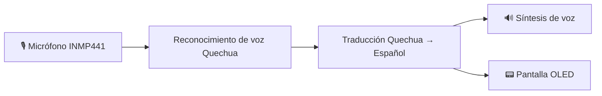
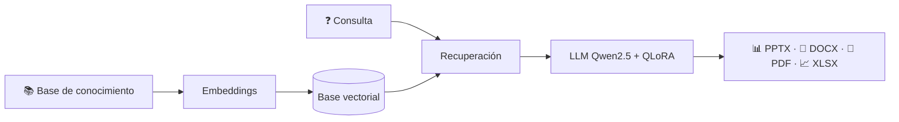

<div align="center">


<br>


<br><br>

<a href="https://github.com/Jhon-ArSa"></a>
<!-- REEMPLAZA TU-USUARIO con tu usuario real de LinkedIn -->
<a href="https://www.linkedin.com/in/TU-USUARIO/"></a>
<!-- REEMPLAZA con tu correo real -->
<a href="mailto:TU_CORREO@gmail.com"></a>

</div>

<br>

<div align="center">

[**Sobre mí**](#-sobre-mí) · [**Stack**](#-tech-stack) · [**Proyectos**](#-proyectos-destacados) · [**Investigación**](#️-computer-vision--research) · [**Estadísticas**](#-estadísticas-de-github) · [**Hoja de ruta**](#️-hoja-de-ruta-2026) · [**Contacto**](#-conecta-conmigo)

</div>

---

## 👨‍💻 Sobre mí

<table>
<tr>
<td width="60%" valign="top">

Soy estudiante de **Ingeniería de Sistemas en la Universidad Nacional del Centro del Perú (UNCP)**, cursando el **8.º semestre**, y vivo en Huancayo, Junín 🇵🇪.

Me apasiona crear **sistemas inteligentes**: IA aplicada, **IA Offline**, **Edge AI**, backend y automatización. Mi meta es ser **AI Engineer**, uniendo ingeniería de software, inteligencia artificial y soluciones a problemas reales.

- 🔭 Construyendo: **QHICHWA-BAND**, **RAG Educativo** y **WAWA-AI**
- 🌱 Aprendiendo: **Cloud, DevOps, seguridad e inglés**
- 💬 Pregúntame sobre: **Python, LLMs, RAG, YOLO/OpenCV, Raspberry Pi, Laravel, Flutter**
- ⚡ Dato curioso: estoy desarrollando un traductor **Quechua → Español** que funciona **sin Internet**
- 🤝 Busco: prácticas, investigación y colaboraciones en IA

</td>
<td width="40%" align="center" valign="middle">


</td>
</tr>
</table>

```python
class JhonAroni:
    rol         = "AI Engineer en formación"
    universidad = "UNCP · Ingeniería de Sistemas"
    ubicacion   = "Huancayo, Junín, Perú 🇵🇪"
    enfoque     = ["LLMs", "RAG", "Edge AI", "Computer Vision", "Backend"]
    aprendiendo = ["Cloud", "DevOps", "Seguridad", "Inglés"]
    mision      = "Construir tecnología con propósito"
```

---

## ⚡ Tech Stack

<table>
<tr>
<td width="25%" align="center"><b>👨‍💻 Lenguajes</b></td>
<td></td>
</tr>
<tr>
<td align="center"><b>🧩 Frameworks</b></td>
<td></td>
</tr>
<tr>
<td align="center"><b>🤖 IA y datos</b></td>
<td></td>
</tr>
<tr>
<td align="center"><b>🗄️ Bases de datos</b></td>
<td></td>
</tr>
<tr>
<td align="center"><b>🛠️ Herramientas</b></td>
<td></td>
</tr>
</table>

### 🤖 Especialidades en IA

<div align="center">


</div>

---

## 🚀 Proyectos destacados

<table>
<tr>
<td width="33%" valign="top">

### 🗣️ QHICHWA-BAND
Wearable de traducción **Quechua → Español** con IA offline, reconocimiento y síntesis de voz.


</td>
<td width="33%" valign="top">

### 📚 RAG Educativo
Generación de material académico (PPTX, DOCX, PDF, XLSX) desde conocimiento recuperado.


</td>
<td width="33%" valign="top">

### 📱 WAWA-AI
App móvil con funciones inteligentes, hecha con **React Native + Expo**.


</td>
</tr>
</table>

<details>
<summary><b>🧩 Arquitectura de QHICHWA-BAND</b></summary>



</details>

<details>
<summary><b>🧩 Arquitectura del RAG Educativo</b></summary>



</details>

### 📌 Repositorios fijados

<!-- REEMPLAZA NOMBRE-DEL-REPO-1 a -4 por tus repositorios reales -->
<div align="center">

<a href="https://github.com/Jhon-ArSa/NOMBRE-DEL-REPO-1"></a>
<a href="https://github.com/Jhon-ArSa/NOMBRE-DEL-REPO-2"></a>
<a href="https://github.com/Jhon-ArSa/NOMBRE-DEL-REPO-3"></a>
<a href="https://github.com/Jhon-ArSa/NOMBRE-DEL-REPO-4"></a>

</div>

---

## 👁️ Computer Vision & Research

<div align="center">


</div>

| | Línea de investigación |
|---|---|
| 🐹 | Visión artificial aplicada a gestión y conteo de cuyes |
| 🚁 | Sistemas de drones con visión artificial |
| 🏥 | Computer Vision para aplicaciones de emergencia |
| 🌱 | Inteligencia Artificial aplicada al sector agropecuario |
| 📊 | Análisis automatizado mediante Deep Learning |

---

## 📊 Estadísticas de GitHub

<div align="center">


<br>


<br>

<!-- Requiere el workflow snake.yml en .github/workflows/ -->
<picture>
  <source media="(prefers-color-scheme: dark)" srcset="https://raw.githubusercontent.com/Jhon-ArSa/Jhon-ArSa/output/github-snake-dark.svg"/>
  <source media="(prefers-color-scheme: light)" srcset="https://raw.githubusercontent.com/Jhon-ArSa/Jhon-ArSa/output/github-snake.svg"/>
  
</picture>

<br>


</div>

---

## 🗺️ Hoja de ruta 2026

- [x] Base en Python, backend y desarrollo móvil/web
- [x] Proyectos de IA aplicada (RAG, Edge AI, Computer Vision)
- [ ] Profundizar en **Cloud & DevOps** (contenedores, CI/CD, despliegue)
- [ ] Fortalecer **seguridad de la información**
- [ ] Mejorar **inglés** técnico y profesional
- [ ] Consolidar un portafolio de proyectos de IA con documentación y demos

---

## 🤝 Colaboración

Abierto a prácticas, proyectos de investigación y colaboraciones en **IA, Computer Vision, Edge AI y backend**. Si tienes una idea, abre un *issue* en mis repositorios o escríbeme.

---

## 🌎 Conecta conmigo

<div align="center">

<a href="https://github.com/Jhon-ArSa"></a>
<a href="https://www.linkedin.com/in/TU-USUARIO/"></a>
<a href="mailto:TU_CORREO@gmail.com"></a>

<br><br>


### 💻 Building intelligent systems with purpose.


</div>
