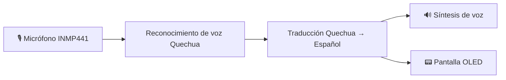
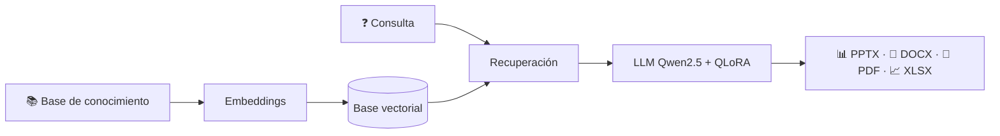

<div align="center">


<br><br>


<br><br>

<a href="https://github.com/Jhon-ArSa"></a>
<!-- REEMPLAZA TU-USUARIO con tu usuario real de LinkedIn -->
<a href="https://www.linkedin.com/in/TU-USUARIO/"></a>
<!-- REEMPLAZA con tu correo real -->
<a href="mailto:TU_CORREO@gmail.com"></a>

</div>

---

## 🧠 Sobre mí

<table>
<tr>
<td width="62%" valign="top">

Soy estudiante de **Ingeniería de Sistemas en la Universidad Nacional del Centro del Perú (UNCP)**, cursando el **8.º semestre**.

Me interesa el desarrollo de **sistemas inteligentes**, **IA Offline**, **Edge AI**, backend y automatización de procesos. Mi meta es ser **AI Engineer**, combinando ingeniería de software, inteligencia artificial y soluciones aplicadas a problemas reales.

```python
class JhonAroni:
    rol        = "AI Engineer en formación"
    ubicacion  = "Huancayo, Junín, Perú 🇵🇪"
    estudia    = "Ingeniería de Sistemas · UNCP"
    enfoque    = ["LLMs", "RAG", "Edge AI", "Computer Vision"]
    aprendiendo = ["Cloud", "DevOps", "Seguridad", "Inglés"]
    mision     = "Construir tecnología con propósito"
```

</td>
<td width="38%" align="center" valign="middle">


</td>
</tr>
</table>

### 🚀 Actualmente enfocado en

<div align="center">


</div>

---

## ⚡ Tech Stack

<details open>
<summary><b>👨‍💻 Lenguajes</b></summary>
<br>
<p align="center"></p>
</details>

<details open>
<summary><b>🧩 Frameworks y desarrollo</b></summary>
<br>
<p align="center"></p>
</details>

<details open>
<summary><b>🤖 IA y datos</b></summary>
<br>
<p align="center"></p>
</details>

<details open>
<summary><b>🛠️ Herramientas</b></summary>
<br>
<p align="center"></p>
</details>

---

## 🚀 Proyectos destacados

<table>
<tr>
<td width="33%" valign="top">

### 🗣️ QHICHWA-BAND
Wearable de traducción **Quechua → Español** con IA offline en el dispositivo, reconocimiento de voz y síntesis de voz.

`Python` `Raspberry Pi` `Speech AI` `Edge AI` `OLED` `INMP441`

</td>
<td width="33%" valign="top">

### 📚 RAG Educativo
Sistema **RAG** que genera material académico (PowerPoint, Word, PDF, Excel) a partir de conocimiento recuperado.

`Python` `Qwen2.5` `QLoRA` `RAG` `Embeddings`

</td>
<td width="33%" valign="top">

### 📱 WAWA-AI
App móvil con **React Native + Expo** que integra funcionalidades inteligentes.

`React Native` `Expo` `TypeScript` `Android`

</td>
</tr>
</table>

<details>
<summary><b>🧩 Ver arquitectura de QHICHWA-BAND</b></summary>



</details>

<details>
<summary><b>🧩 Ver arquitectura del RAG Educativo</b></summary>



</details>

### 📌 Repositorios fijados (se actualizan solos)

<!-- REEMPLAZA NOMBRE-DEL-REPO por el nombre real de cada repositorio (uno por tarjeta) -->
<div align="center">

<a href="https://github.com/Jhon-ArSa/NOMBRE-DEL-REPO-1"></a>
<a href="https://github.com/Jhon-ArSa/NOMBRE-DEL-REPO-2"></a>

<a href="https://github.com/Jhon-ArSa/NOMBRE-DEL-REPO-3"></a>
<a href="https://github.com/Jhon-ArSa/NOMBRE-DEL-REPO-4"></a>

</div>

---

## 👁️ Computer Vision & Research

<div align="center">


</div>

* 🐹 Visión artificial aplicada a gestión y conteo de cuyes
* 🚁 Sistemas de drones con visión artificial
* 🏥 Computer Vision para aplicaciones de emergencia
* 🌱 IA aplicada al sector agropecuario
* 📊 Análisis automatizado mediante Deep Learning

---

## 📊 Analítica de GitHub

<div align="center">


<br>


</div>

### 🐍 Contribuciones (serpiente animada)

<!-- Requiere el workflow .github/workflows/snake.yml incluido (se genera solo cada 12 h) -->
<div align="center">
<picture>
  <source media="(prefers-color-scheme: dark)" srcset="https://raw.githubusercontent.com/Jhon-ArSa/Jhon-ArSa/output/github-snake-dark.svg"/>
  <source media="(prefers-color-scheme: light)" srcset="https://raw.githubusercontent.com/Jhon-ArSa/Jhon-ArSa/output/github-snake.svg"/>
  
</picture>
</div>

### 🏆 Trofeos

<div align="center">

</div>

---

## 🗺️ Hoja de ruta 2026

- [x] Base en Python, backend y desarrollo móvil/web
- [x] Proyectos de IA aplicada (RAG, Edge AI, Computer Vision)
- [ ] Profundizar en **Cloud & DevOps** (contenedores, CI/CD, despliegue)
- [ ] Fortalecer **seguridad de la información**
- [ ] Mejorar **inglés** técnico y profesional
- [ ] Consolidar un portafolio de proyectos de IA con documentación y demos

---

## 🎯 Objetivos profesionales

<div align="center">

| 🤖 **AI Engineer** | 🐍 **Python** | ⚡ **Edge AI** | ☁️ **Cloud & DevOps** |
|:---:|:---:|:---:|:---:|

</div>

## 🤝 Colaboración

Abierto a prácticas, proyectos de investigación y colaboraciones en **IA, Computer Vision, Edge AI y backend**. Abre un *issue* en mis repositorios o escríbeme.

---

## 💬 Frase del día

<div align="center">

</div>

<div align="center">

### 💻 Building intelligent systems with purpose.


</div>
